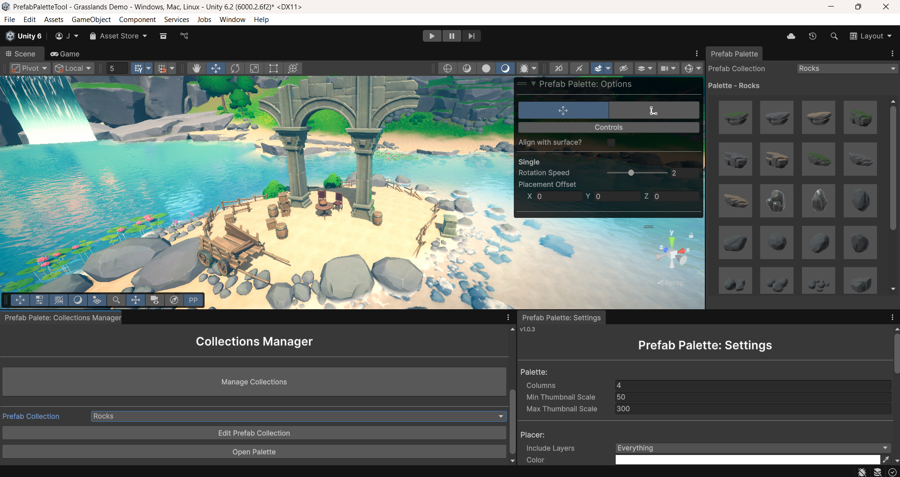
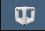
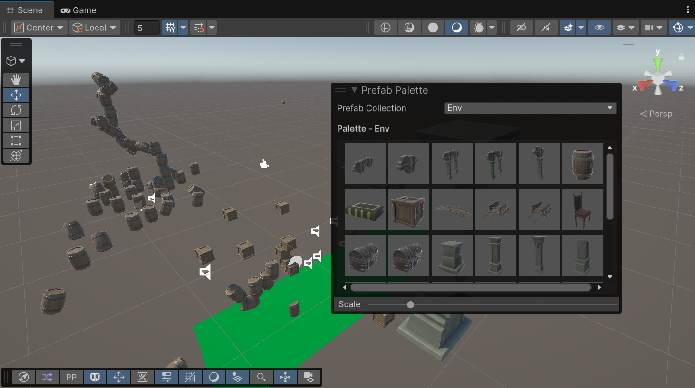
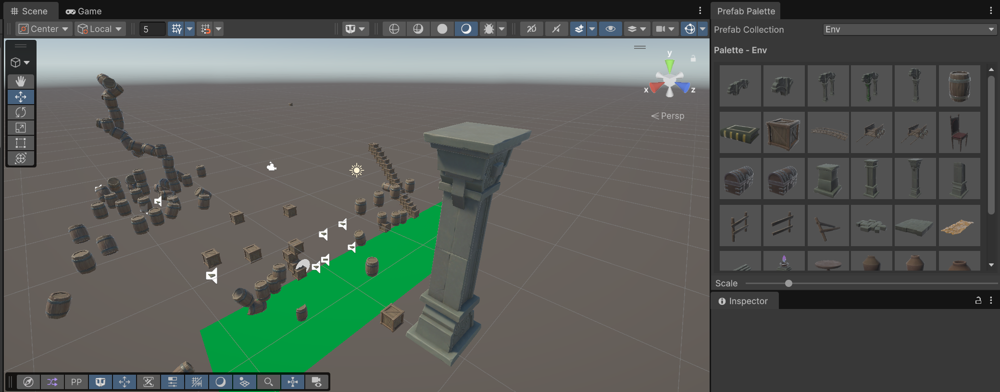
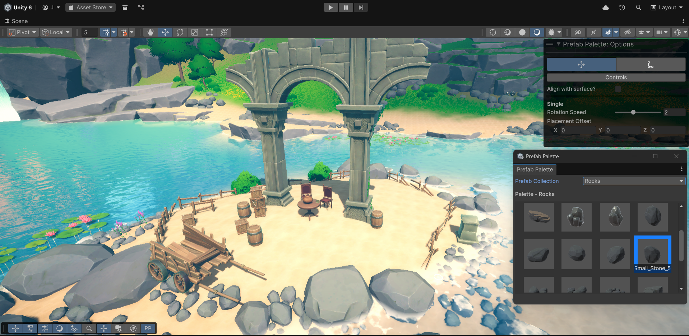
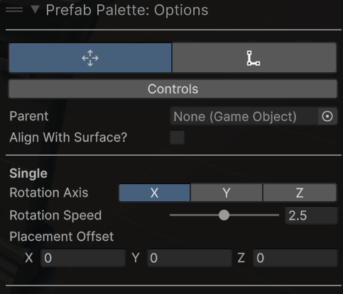
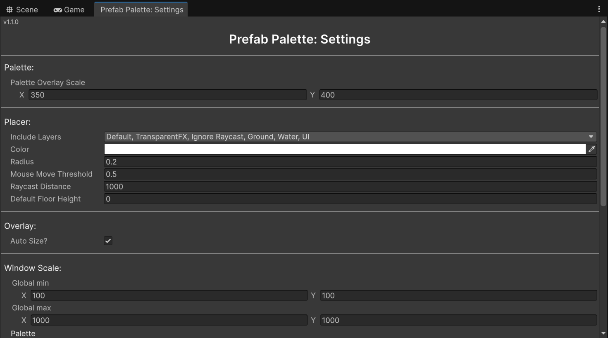

# Prefab Palette

**Unity Editor tool for fast visual prefab placement directly in the Scene View**.

Instead of repeatedly dragging prefabs into your scene, this tool lets you organise prefabs into collections, select them from a palette, and place them using specialised placement modes.

Perfect for **level design, environment building, and rapid scene assembly** in both 2D and 3D projects.

---

## Unity Compatibility
Unity **2021.2+**

---

# Installation

1. Download the latest `.unitypackage` from the **Releases** page.
2. Drag the package into your Unity project.
3. Import all files.

The `PrefabPalette` folder is self-contained and can be moved anywhere inside the project as long as its internal structure is unaltered.

---

# Quick Start

### 1. Create a Prefab Collection

1. Navigate to your prefab folder in the **Project Window**
2. Right-click the folder or selected prefabs
3. Select **Create Prefab Collection**
4. Enter a name and press **Create**

After the domain reload, the collection will appear in the palette.

---

### 2. Open the Palette

The palette can be opened as a window and an overlay.

#### Palette Overlay

Unity Version:

**2021.2 – 2022.3**

Press the *backtick ( ` )* key to open the overlay menu, and ensure ``Prefab Palette`` is checked.

**2023.1+**

Use the Scene View overlay toolbar icon:

The palette can now be opened in the scene view and docked for quick use.

#### Palette Window:

Open via:

`Window → Prefab Palette → Palette`

---

### 3. Select a Prefab

Choose a collection from the dropdown and click a prefab thumbnail.

---

### 4. Start Placing

Move your mouse in the Scene View.

A **target reticle** will follow the cursor and show exactly where the prefab will be placed.

Click to place objects.

---

# Core Features

### Prefab Collections
Organise prefabs into reusable collections created from folders or selected assets.

### Palette Window
Browse prefab collections and select assets using thumbnail previews.

### Scene View Overlay
Adjust placement settings and switch placement modes directly inside the Scene View.

### Visual Placer
A dynamic reticle previews exactly where the prefab will be placed before clicking.

### Placement Modes
Specialised placement behaviours designed for different workflows.

### Native Unity Integration
Fully compatible with Unity’s **Undo/Redo system** and **Snap Controls**.

### Supports both 2D and 3D Modes
Automatically detects when the Scene View switches between modes and adjusts placement behaviour accordingly.

### Customisable Settings
Adjust palette scaling, overlay size, reticle appearance, physics layers, and more.

### Extensible Architecture
Prefab Palette uses a modular state-based design, making it easy to implement custom placement modes.

See the [Developer Guide](./_NoShip/Developers.md#creating-new-mode).

---

# Options Overlay

The overlay allows you to:

- Toggle placement settings
- Switch placement modes
- Adjust mode-specific options

### Opening the Overlay

Unity Version:

**2021.2 – 2022.3**

Press the *backtick ( ` )* key to open the overlay menu, then select:

`Prefab Palette: Options`

**2023.1+**

Use the Scene View overlay toolbar icon.

---

## Settings

## Global Mode Options

| Option | Effect |
|--------|--------|
| Parent | Object instantiated prefabs will be parented under in the hierarchy  |

### 3D only

| Option | Effect |
|------|------|
| Align with surface | Aligns the prefab rotation with the surface normal |

### 2D only

| Option | Effect |
|------|------|
| Depth | Z depth prefabs will be placed with |

---

## Single Mode

Places a single prefab instance.

### Options

| Option | Type | Effect |
|------|------|------|
| Rotation Axis | Toolbar | Selected axis to be rotated around |
| Rotation Speed | Slider | Controls how fast the object rotates |
| Placement Offset | Vector3 | Offsets placement relative to the click position |

---

## Line Mode

Draw a line of prefabs with controlled spacing and orientation.

Useful for **fences, walls, and structured placement**.

### Options

| Option | Type | Effect |
|------|------|------|
| Spacing | Float | Distance between prefabs |
| Relative Rotation | Vector3 | Rotation relative to line direction |
| Variable Rotation | Toggle | Applies random rotation |
| Range | Min/Max Slider | Constrained rotation range |
| Axis | Toggle | Enables/disables random rotation per axis |
| Chain Lines | Toggle | Continue placement from previous line |
| Link Offset | Vector3 | Offset from previous line endpoint |
| Use Alt Objects | Toggle | Enable alternate prefab placement |
| Random | Toggle | Random placement probability |

---

# Tool Settings

Open via:

`Window → Prefab Palette → Settings`

---

## Palette

| Option | Effect |
|------|------|
| Overlay Scale | Palette overlay size |

---

## Placer

| Option | Effect |
|------|------|
| Include Layers | Physics layers used in placement raycast |
| Color | Reticle colour |
| Radius | Reticle size |
| Mouse Move Threshold | Adjust placement sensitivity |
| Raycast Distance | Max placement distance from the scene view camera |
| Default Floor Height | Height prefabs are placed in empty scenes (3D only) |

---

## Overlay

| Option | Effect |
|------|------|
| Auto Size | Automatically resize overlay window |
| Size | Fixed overlay width and height |

---

## Window Scale:

| Option | Effect |
|------|------|
| Global Min & Global Max | Shared default window size (Only applied if per window scale is set to use global) |
| Per Window Scale | If use global is false, windows will respect individual max and min settings. |

# FAQ

### Can't find the overlay?

Ensure the tool imported correctly by checking:

`Window → Prefab Palette`

Then open the overlay using the method appropriate for your Unity version.

---

### Objects are stacking or jittering

Check:

`Tool Settings → Placer → Include Layers`

Disable the physics layer used by your prefabs.

---

### Why can't this be installed via Unity Package Manager?

Prefab Palette generates an enum at runtime to populate dropdowns with available prefab collections.

Unity Package Manager packages must remain immutable, which prevents runtime file generation inside the package assembly.

---

# Support the Project

If you find the tool useful and want to support development, donations are welcome.

---

# Documentation

Additional documentation:

- [Developer Guide](./_NoShip/Developers.md)
- [Contribution Guide](./_NoShip/ContributionsGuide.md)

---

# License

See [License](./License.md) for terms of use, redistribution, and modification.

---

# Changelog

Release history:

[Changelog](./Changelog.md)

---

# Issues & Feature Requests

For bug reports, feature requests, or questions, please use the **GitHub Issues** page.